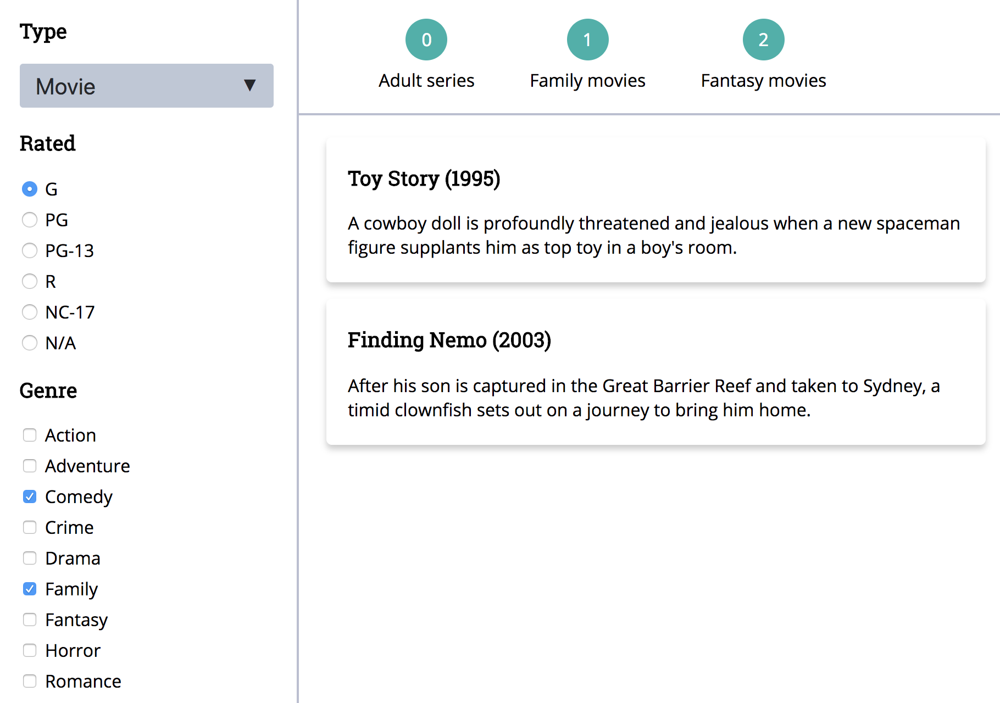

# SeekandHit Demo Project

Base project for job candidates applying for frontend developer position at [Seekandhit](https://seekandhit.com/).

## Technology

* `react`
* `redux`
* `ES6`
* `Functional Programming`

## Project Goal

Goal of the project is to build a client app which would consume the API provided by this repo.
Main features should be the following:

* listing all the movie data
* filtering the movie data by at least 3 of the characterics of the data model (e.g. genre, rating, type)
* grouping the movie data (having some preset values for all the available filters - e.g. R rated movies with IMDB rating > 7.5 )

MVP should have at least 3 hardcoded groups. For extra credits you can make the groups dynamic by enabling the user to save the current filter state as a new group.
No backend code is required for that, `json-server` can help you with that by just adding a new model to `db.json`.

## Development

Fork this repo and install the dependencies using `npm i`.
To start the backend server on port 3000, type the command `npm run server`.
Server provides a RESTful API following the documentation [here](https://github.com/typicode/json-server).
Data model can be observed in `db.json`.

## Layout suggestion

